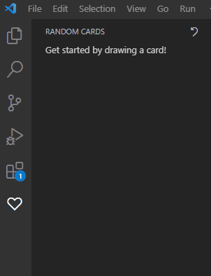
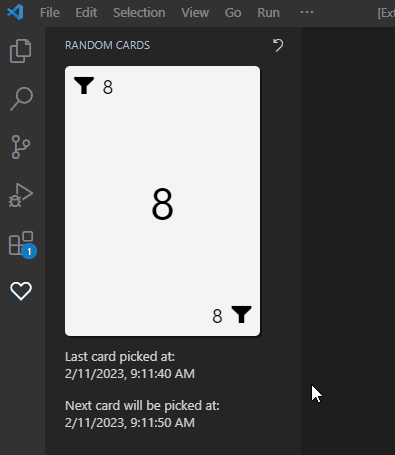
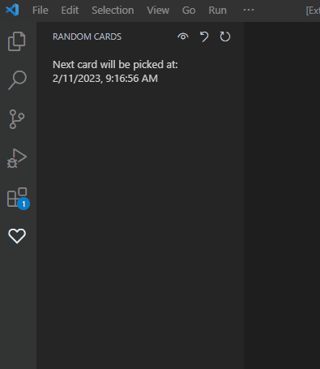
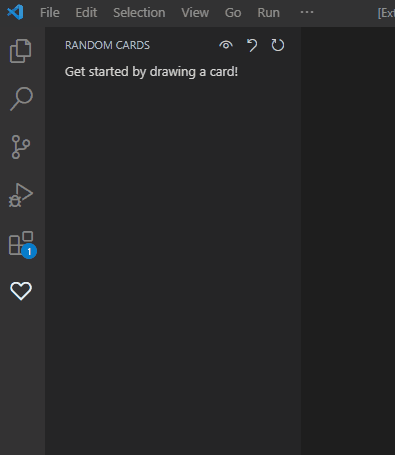
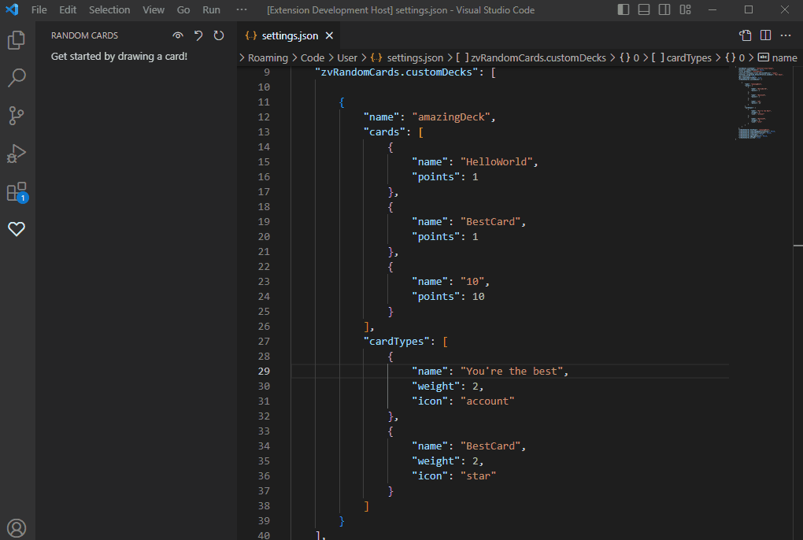

# zv-random-cards

A small extension to randomly pick cards from a deck. 
Also a great way to stretch between coding sessions as the cards can be changed for small exercises or anything to your liking.

# Features

## Randomly draw a card from a predefined deck or a custom defined one



## Automatically draw a card on a set interval and enable notifications
You can enable a set interval at which a new card will be drawn. This is a good way to customize the deck with stretch exercises to remind you to get up during long coding sessions.



## Pile your card to avoid missing them
Card will be stacked until you acknowledge them or reset the whole pile.



## Use weight if some card should be more valuable than others
Define on the card type, weight is a modifier on the card points to have some cards more valuable than others.



## Customize your deck
You can create your own deck and define each card to your liking.



The following format can be used to create your deck. For each card type, a new card will be added.
The extension supports any [codicons](https://microsoft.github.io/vscode-codicons/dist/codicon.html).

```json
[{
    "name": "myDeck",
    "cards": [{
        "name": "CardA",
        "points": 1
    },{
        "name": "CardB",
        "points": 2
    }],
    "cardTypes": [{
        "name": "Heart",
        "weight": 2,
        "icon": "heart"
    },{
        "name": "Spades"
    }]
}]
```
